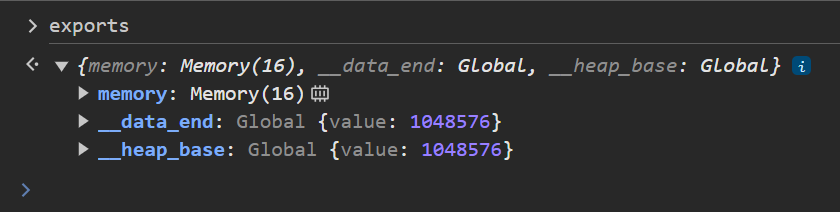
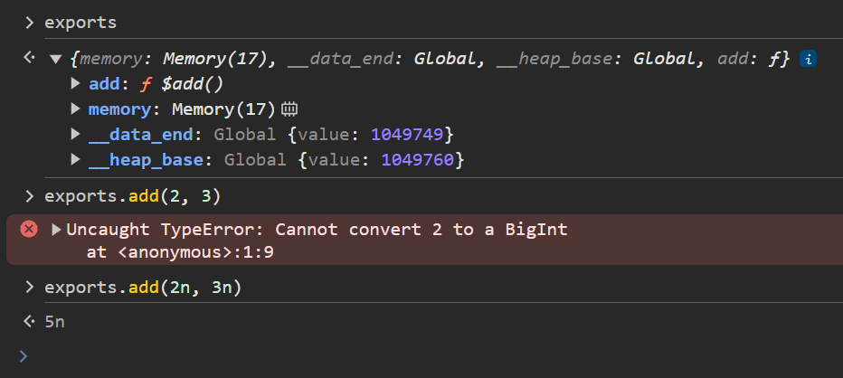
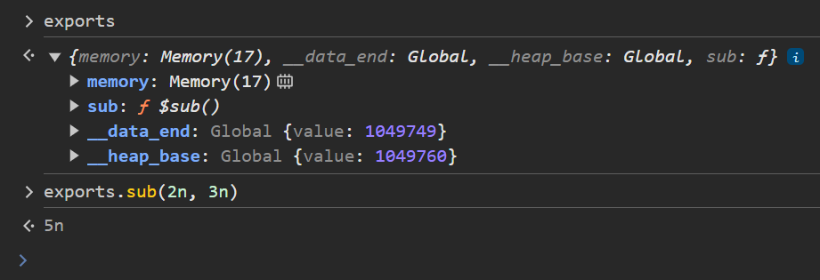
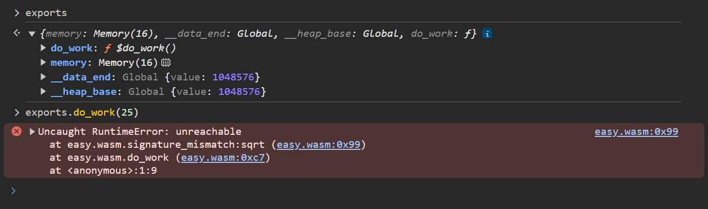
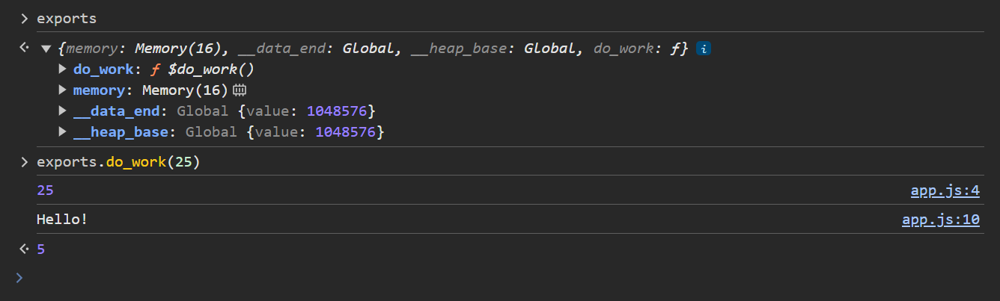

- [Rust Wasm Without Bloat](#rust-wasm-without-bloat)
  - [Setup](#setup)
    - [Installing `wasm32-unknown-unknown` target using `rustup`](#installing-wasm32-unknown-unknown-target-using-rustup)
    - [Creating a library crate using `cargo`](#creating-a-library-crate-using-cargo)
  - [Coding](#coding)
    - [Compiling to a `.wasm` binary](#compiling-to-a-wasm-binary)
    - [Setting up the javascript](#setting-up-the-javascript)
    - [Exporting things](#exporting-things)
      - [Exporting with a different name](#exporting-with-a-different-name)
    - [Importing things](#importing-things)
      - [Importing from a different namespace](#importing-from-a-different-namespace)
      - [Importing many things from one namespace](#importing-many-things-from-one-namespace)
      - [Importing with a different name](#importing-with-a-different-name)
      - [Avoiding unsafe](#avoiding-unsafe)
- [Environment](#environment)

# Rust Wasm Without Bloat
This guide will help you setup a rust project that can be compiled to wasm without bloat.
Bloat includes but is not limited to `wasm-pack` and `wasm-bindgen`.

## Setup
### Installing `wasm32-unknown-unknown` target using `rustup`
In order to compile rust code to wasm, we need to install the `wasm32-unknown-unknown` target.

```shell
$ rustup target add wasm32-unknown-unknown
info: component 'rust-std' for target 'wasm32-unknown-unknown' is up to date
```

### Creating a library crate using `cargo`
Both binary and library crates can be compiled to wasm with minimal difference.
Since the wasm binary will not be executing on its own,
I will use a library crate because it makes more sense to me.

```shell
$ cargo new easy --vcs=none --lib
    Creating library `easy` package
note: see more `Cargo.toml` keys and their definitions at https://doc.rust-lang.org/cargo/reference/manifest.html
$ cd easy/
easy$ ls
Cargo.toml  src
```

## Coding
### Compiling to a `.wasm` binary
Lets take a look a look at what cargo generated for us.

`src/lib.rs`
```rust
pub fn add(left: u64, right: u64) -> u64 {
  left + right
}

#[cfg(test)]
mod tests {
  use super::*;

  #[test]
  fn it_works() {
    let result = add(2, 2);
    assert_eq!(result, 4);
  }
}
```

Lets remove the test related code so that we can focus on our goal.

`src/lib.rs`
```diff
pub fn add(left: u64, right: u64) -> u64 {
  left + right
}

-#[cfg(test)]
-mod tests {
-  use super::*;
-
-  #[test]
-  fn it_works() {
-    let result = add(2, 2);
-    assert_eq!(result, 4);
-  }
-}
```

Lets compile the crate normally.

```shell
easy$ cargo build
   Compiling easy v0.1.0 (easy)
    Finished `dev` profile [unoptimized + debuginfo] target(s) in 0.68s
easy$ ls target/debug/
build  deps  examples  incremental  libeasy.d  libeasy.rlib
```

Now lets compile to the wasm target.

```shell
easy$ cargo build --target wasm32-unknown-unknown
   Compiling easy v0.1.0 (easy)
    Finished `dev` profile [unoptimized + debuginfo] target(s) in 0.20s
easy$ ls target/wasm32-unknown-unknown/debug/
build  deps  examples  incremental  libeasy.d  libeasy.rlib
```

Where is the `easy.wasm` file?

In order to generate the wasm binary, we must add a section to `Cargo.toml`.

`Cargo.toml`
```diff
[package]
name = "easy"
version = "0.1.0"
edition = "2021"

+[lib]
+crate-type = ["cdylib"]

[dependencies]
```

"cdylib" = c dynamic library.
When compiling to the wasm target it means a wasm binary.

```shell
easy$ cargo build --target wasm32-unknown-unknown
   Compiling easy v0.1.0 (easy)
    Finished `dev` profile [unoptimized + debuginfo] target(s) in 0.31s
easy$ ls target/wasm32-unknown-unknown/debug/
build  deps  easy.d  easy.wasm  examples  incremental  libeasy.d  libeasy.rlib
```

Great, now we have a binary.

### Setting up the javascript
```shell
easy$ touch index.html app.js
easy$ ls
Cargo.lock  Cargo.toml  app.js  index.html  src  target
```

`index.html`
```diff
+<script type="module" src="app.js"></script>
```

`app.js`
```diff
+const {
+  instance: { exports },
+} = await WebAssembly.instantiateStreaming(
+  fetch('target/wasm32-unknown-unknown/debug/easy.wasm'),
+);
+
+window.exports = exports;
```

If you open `index.html` in a browser and open devtools you will see a cors error.
In order to develop the code locally we will need an http server to host the files for us.
I will use `http-server` from `npm` but you can use any other http server.

```shell
easy$ http-server -sp 9000 &
[3] 6047
easy$
```

If you take a look at the `exports` variable in devtools, you will see that the `add`
function is not available. This is because it was not exported.



---

> [!IMPORTANT]
> From here on forward, it is assumed that you compile the project (`cargo build --target wasm32-unknown-unknown`)
> before you test any changes you make.

### Exporting things

As we just saw, the `add` function was not exported.
In fact, it was not even included in the final binary.

In order to export a function from rust, we need to add an attribute to it.[^unsafe-attrs]

`src/lib.rs`
```diff
+#[unsafe(no_mangle)]
pub fn add(left: u64, right: u64) -> u64 {
  left + right
}
```

`no_mangle` can be thought of as "export this function with this exact name".
If you wanted to you could even remove `pub` and the function would still be exported.

Now lets check if `add` is exported.



It indeed is, and works!
However, we did have to use the js bigint literal notation (`XXXn`) to pass in the arguments,
and got back a bigint.
This is because `u64` from rust is represented by bigints in js.

#### Exporting with a different name
What if we wanted to export the function with a different name than what it is declared as?
We can do that using the `export_name` attribute.[^unsafe-attrs]

`src/lib.rs`
```diff
-#[unsafe(no_mangle)]
+#[unsafe(export_name = "sub")]
pub fn add(left: u64, right: u64) -> u64 {
  left + right
}
```

> [!NOTE]
> Exporting the `add` function which adds two integers with the name `sub` is just for demonstration.
> Do not export functions with a different name than their behaviour.



### Importing things
Just as we are able to export functions from rust to js, we can also import functions from js to rust.
Lets see how that is done by importing several functions.

First we define an `extern` block that specifies the names and signatures of the functions we
want to import.

`src/lib.rs`
```diff
+extern "C" {
+  fn print(x: f32);
+  fn sqrt(x: f32) -> f32;
+  fn printHello();
+}
```

Here we declare 3 functions that are to be imported:
1. `print` which takes an `f32`
2. `sqrt` which takes and returns an `f32`
3. `printHello` which has no arguments or return value

Now we can make use of them.

`src/lib.rs`
```diff
extern "C" {
  fn print(x: f32);
  fn sqrt(x: f32) -> f32;
  fn printHello();
}

+#[unsafe(no_mangle)]
+pub fn do_work(x: f32) -> f32 {
+  let result = unsafe { sqrt(x) };
+  unsafe {
+    print(x);
+    printHello();
+  }
+  result
+}
```

Next, we need to supply the functions when instantiating the wasm module.

`app.js`
```diff
+const imports = {
+  env: {
+    print(x) {
+      console.log(x);
+    },
+
+    sqrt: Math.sqrt,
+
+    printHello() {
+      console.log('Hello!');
+    },
+  },
+};

const {
  instance: { exports },
} = await WebAssembly.instantiateStreaming(
  fetch('target/wasm32-unknown-unknown/debug/easy.wasm'),
+  imports,
);

window.exports = exports;
```

Notice that we declare the functions under the `env` namespace (key).
That is the default namespace that rust will import from.

Lets check if everything works.



It does not. Luckily we have a hint as to what went wrong.

#### Importing from a different namespace
`signature_mismatch` is telling us that the signature that we declared for the `sqrt` function was
different than that of the function which was compiled. But wait, how could we have compiled the `sqrt`
function when it is to be imported from js?

The answer is that by default, `extern` blocks define symbols that are managed by the linker.
In simple terms, a `sqrt` function was available during link time, and was not the one we wanted.
It could be coming from a different library, or who knows where, we do not care.

In order to avoid name collisions with other symbols available during linking, we need to tell rust
that we want the items inside the `extern` block to be treated as wasm imports.

`src/lib.rs`
```diff
+#[link(wasm_import_module = "env")]
extern "C" {
  fn print(x: f32);
  fn sqrt(x: f32) -> f32;
  fn printHello();
}
```

This does two things. First, it tells rust to treat the items as wasm imports. Secondly, it tells rust
to import them from the `env` namespace.



#### Importing many things from one namespace
Lets say you wanted to use more functions from js's `Math` object.
One thing you could do is declare more signatures and update the imports on the js side, but that can get tedious.
An easier way to do so would be to define a separate `extern` block that imports from the `Math` namespace and pass
in the entire Math object as an import. This would make it so that we would only need to add the signatures of the
functions we want to import, without ever having to touch the js imports.

`src/lib.rs`
```diff
#[link(wasm_import_module = "env")]
extern "C" {
  fn print(x: f32);
-  fn sqrt(x: f32) -> f32;
  fn printHello();
}

+#[link(wasm_import_module = "Math")]
+extern "C" {
+  fn sqrt(x: f32) -> f32;
+  fn cos(x: f32) -> f32;
+  fn random() -> f64;
+}
```

`app.js`
```diff
const imports = {
  env: {
    print(x) {
      console.log(x);
    },

-    sqrt: Math.sqrt,

    printHello() {
      console.log('Hello!');
    },
  },
+  Math,
};
```

#### Importing with a different name
Just like we can [export things with a different name](#exporting-with-a-different-name) than what they
were declared as, we can also import things with a different name than they are declared as.

`src/lib.rs`
```diff
#[link(wasm_import_module = "env")]
extern "C" {
  fn print(x: f32);
  fn sqrt(x: f32) -> f32;
-  fn printHello();
+  #[link_name = "printHello"]
+  fn print_hello();
}

#[unsafe(no_mangle)]
pub fn do_work(x: f32) -> f32 {
  let result = unsafe { sqrt(x) };
  unsafe {
    print(x);
-    printHello();
+    print_hello();
  }
  result
}
```

#### Avoiding unsafe
As we saw in the above examples, we had to wrap the function calls to the imported functions inside
unsafe blocks. All items in `extern` blocks are considered unsafe by default because rust has no
control over what they can do when used, and thus if they violate rust's safety rules, they could trigger UB
(undefined behaviour).

One thing we can do is provide safe versions of the functions.

`src/lib.rs`
```diff
+mod js {
  #[link(wasm_import_module = "env")]
  extern "C" {
-    fn print(x: f32);
-    fn sqrt(x: f32) -> f32;
-    fn printHello();
+    pub fn print(x: f32);
+    pub fn sqrt(x: f32) -> f32;
+    pub fn printHello();
  }
+}

+fn print(x: f32) {
+  unsafe { js::print(x) }
+}

+fn sqrt(x: f32) -> f32 {
+  unsafe { js::sqrt(x) }
+}

+fn print_hello() {
+  unsafe { js::printHello() }
+}

#[unsafe(no_mangle)]
pub fn do_work(x: f32) -> f32 {
-  let result = unsafe { sqrt(x) };
-  unsafe {
-    print(x);
-    print_hello();
-  }
+  let result = sqrt(x);
+  print(x);
+  print_hello();
  result
}
```

However, that is a lot of repetetive code. Starting in rust 1.82.0, we have new syntax that reduces this boilerplate.[^1]

`src/lib.rs`
```diff
#[link(wasm_import_module = "env")]
-extern "C" {
-  fn print(x: f32);
-  fn sqrt(x: f32) -> f32;
-  fn printHello();
+unsafe extern "C" {
+  safe fn print(x: f32);
+  safe fn sqrt(x: f32) -> f32;
+  safe fn printHello();
}

#[unsafe(no_mangle)]
pub fn do_work(x: f32) -> f32 {
-  let result = unsafe { sqrt(x) };
-  unsafe {
-    print(x);
-    printHello();
-  }
+  let result = sqrt(x);
+  print(x);
+  printHello();
  result
}
```

The changes made to `do_work` are the exact same as the safe wrapper version above.
The difference is in the `extern` block. First, we add the `unsafe` keyword to the block.
Second, we mark functions as being safe using the `safe` keyword.
If we do not add `safe` to a function, it defaults to `unsafe`, but you can also explicitly add
the `unsafe` keyword to it.

> [!WARNING]
> Do not simply mark everything as `safe`, that undermines the usage of rust.
> The example however, is ok because:
> * `print` *can* take any `f32`, even `NaN`, and just logs it
> * `sqrt` *can* take any `f32`, even `NaN`, `0`, or a negative number, and *will* return an `f32`
> (which could be `NaN`) *without crashing*
> * `printHello` simply logs something to the console
>
> or in simple terms, none of the functions cause UB, throw an error, or anything else that would violate
> rust's safety rules.
> If you are ever unsure if something is safe, do not mark it as safe.

---

# Environment
```shell
$ rustup -V
rustup 1.27.1 (54dd3d00f 2024-04-24)
info: This is the version for the rustup toolchain manager, not the rustc compiler.
info: The currently active `rustc` version is `rustc 1.82.0 (f6e511eec 2024-10-15)`
$ cargo -V
cargo 1.82.0 (8f40fc59f 2024-08-21)
$ http-server -v
v14.1.1
```

---

I want to quickly compile to a minimal wasm binary. I do not want bloat. Bloat makes things compile
slower. Bloat increases the binary size. Bloat introduces bugs out of my control. Bloat attempts to
define a single way to do things. Bloat evolves backwards.

Bloat grows.

[^unsafe-attrs]: [Starting in rust 1.82.0](https://blog.rust-lang.org/2024/10/17/Rust-1.82.0.html#unsafe-attributes),
the `no_mangle`, `export_name`, and `link_section` attributes are considered
"[unsafe attributes](https://doc.rust-lang.org/nightly/edition-guide/rust-2024/unsafe-attributes.html)"
and should be written as `#[unsafe(...)]`

[^1]: https://blog.rust-lang.org/2024/10/17/Rust-1.82.0.html#safe-items-with-unsafe-extern
